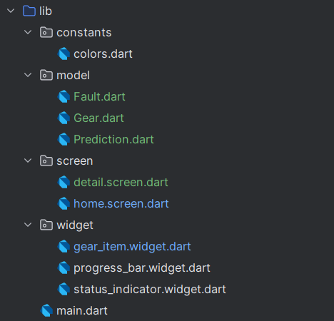
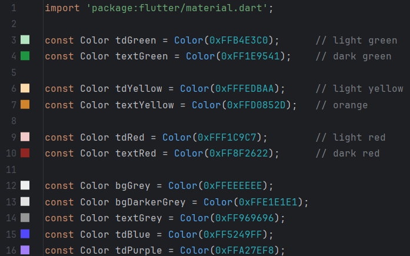

### Summary

* **`Constants`** – Stores global constants like color definitions for consistent styling across the app.
* **`Model`** – Contains plain Dart classes (`Fault`, `Gear`, `Prediction`) used to represent data models.
* **`Screen`** – Holds screen-level UI components such as `Home` (dashboard view) and `Detail` (gear-specific view).
* **`Widget`** – Includes reusable custom widgets like `GearItem`, `ProgressBar`, and `StatusIndicator` that are used across screens.
* **`Interfaces`**


### `Constants`

+ **`colors.dart`** 
Contains constant color values (`tdGreen`, `tdRed`, etc.) used throughout the app for styling consistency.


### `Model`

+ **`Fault`**
```dart
class Fault {
  final int faultId;
  final int faultCode;
  final String faultDesc;
  
  Fault({required this.faultId, required this.faultCode, required this.faultDesc});
}
```
+ **`Gear`**
```dart
class Gear {
  final int gearId;
  final int faultId;
  final DateTime installationDate;
  final double expectedLifetimeHours;

  Gear({required this.gearId, required this.faultId, required this.installationDate, required this.expectedLifetimeHours});
}
```
+ **`Prediction`**
```dart
class Prediction {
  final int gearId;
  final int predictedFaultCode;
  final double predictedRulHours;
  final double confidence;

  Prediction({required this.gearId, required this.predictedFaultCode, required this.predictedRulHours, required this.confidence});
}
```

### `Screen`

* **`Home`**
```dart
class Home extends StatelessWidget {
  Widget build(BuildContext context) {
    return Scaffold(
            appBar: _buildAppBar(),
            backgroundColor: Colors.white,
            body:
            Container(
                    padding : EdgeInsets.symmetric(horizontal:15),
                    child: Column(
                      children: [
                        Row(
                          mainAxisAlignment: MainAxisAlignment.spaceBetween,
                          children:[
                            //Ok Status
                            StatusIndicator(
                              label: 'OK',
                              icon: Icons.check_circle,
                              backgroundColor: tdGreen,
                              iconColor: textGreen,
                              textColor: textGreen,
                            ),
                            //Warning Status
                            StatusIndicator(
                              label: 'Warning',
                              icon: Icons.error,
                              backgroundColor: tdYellow,
                              iconColor: textYellow,
                              textColor: textYellow,
                            ),
                            //Failure Status
                            StatusIndicator(
                              label: 'Failure',
                              icon: Icons.cancel,
                              backgroundColor: tdRed,
                              iconColor: textRed,
                              textColor: textRed,
                            ),
                          ],
                        ),
                        Expanded(
                          child: ListView(
                            padding: const EdgeInsets.symmetric(vertical: 5),
                            children: gears.map((gear) {
                              final fault = faults.firstWhere((f) => f.faultId == gear.faultId);
                              final prediction = predictions.firstWhere((p) => p.gearId == gear.gearId);
                              return GearItem(gear: gear, fault: fault, prediction: prediction);
                            }).toList(),
                          ),
                        )
                      ],
                    )
            )
    );
  }
}
```

* **`Detail`**
A detailed view page for a specific gear
```dart 
class Detail extends StatelessWidget {
  final int gearId;

  const Detail({Key? key, required this.gearId}) : super(key: key);

  @override
  Widget build(BuildContext context) {
    return Scaffold(
      appBar: AppBar(title: Text("Gear #$gearId Details")),
      body: Center(
        child: Text('This is the details page for Gear #$gearId'),
      ),
    );
  }
}
```

### 📁 `Widget`

* **`Gear Item`**
A widget that displays information about a single gear item (used in lists).
```dart 
class GearItem extends StatelessWidget {
  final Gear gear;
  final Fault fault;
  final Prediction prediction;

  const GearItem({
    super.key,
    required this.gear,
    required this.fault,
    required this.prediction,
  });

  @override
  Widget build(BuildContext context) {
    double progress = 1 - (prediction.predictedRulHours / gear.expectedLifetimeHours);

    return InkWell(
      onTap: () {
        Navigator.push(
          context,
          MaterialPageRoute(
            builder: (context) => Detail(gearId: gear.gearId),
          ),
        );
      },
      borderRadius: BorderRadius.circular(20), // Match the card radius
      child: Card(
        elevation: 2,
        color: bgGrey,
        margin: const EdgeInsets.symmetric(vertical: 10),
        shape: RoundedRectangleBorder(borderRadius: BorderRadius.circular(20)),
        child: Padding(
          padding: const EdgeInsets.all(16),
          child: Column(
            crossAxisAlignment: CrossAxisAlignment.start,
            children: [
              Text('Gear #${gear.gearId}', style: const TextStyle(fontSize: 18, fontWeight: FontWeight.bold)),
              const SizedBox(height: 5),

// Fault Info
              Row(
                mainAxisAlignment: MainAxisAlignment.spaceBetween,
                children: [
                  Text('Condition', style: TextStyle(color: textGrey, fontSize: 16)),
                  Container(
                    padding: const EdgeInsets.symmetric(horizontal: 12, vertical: 4),
                    decoration: BoxDecoration(color: tdGreen, borderRadius: BorderRadius.circular(25)),
                    child: Text('Code ${fault.faultCode}', style: TextStyle(color: textGreen)),
                  ),
                ],
              ),
              Text(fault.faultDesc),
              const SizedBox(height: 5),

// Remaining Life
              Row(
                mainAxisAlignment: MainAxisAlignment.spaceBetween,
                children: [
                  Text('Remaining life', style: TextStyle(color: textGrey, fontSize: 16)),
                  Text('${prediction.predictedRulHours.toStringAsFixed(0)} hours',
                          style: const TextStyle(fontWeight: FontWeight.bold)),
                ],
              ),
              const SizedBox(height: 5),

              ProgressBar(
                width: MediaQuery.of(context).size.width,
                height: 20,
                progress: progress.clamp(0.0, 1.0),
              ),

              const SizedBox(height: 10),

// Recommended Action
              Container(
                padding: const EdgeInsets.all(10),
                width: MediaQuery.of(context).size.width,
                decoration: BoxDecoration(color: Colors.white, borderRadius: BorderRadius.circular(20)),
                child: Column(
                  crossAxisAlignment: CrossAxisAlignment.start,
                  children: [
                    Text('Recommended Action', style: TextStyle(color: tdBlue, fontSize: 16)),
                    const Text('Schedule inspection within 72 hours', style: TextStyle(color: tdPurple, fontSize: 14)),
                    const SizedBox(height: 8),
                    SizedBox(
                      width: double.infinity,
                      child: ElevatedButton(
                        style: ElevatedButton.styleFrom(
                          backgroundColor: Colors.blue,
                          foregroundColor: Colors.white,
                          shape: RoundedRectangleBorder(borderRadius: BorderRadius.circular(8)),
                          padding: const EdgeInsets.symmetric(vertical: 16),
                        ),
                        onPressed: () => print('Schedule maintenance for gear ${gear.gearId}'),
                        child: const Text('Schedule Maintenance Now', style: TextStyle(fontSize: 16)),
                      ),
                    ),
                  ],
                ),
              ),
            ],
          ),
        ),
      ),
    );
  }
```
* **`Progress Bar`**
A custom progress bar used to visualize remaining life.
```dart
class ProgressBar extends StatelessWidget {
  const ProgressBar({super.key,required this.width,required this.height,required this.progress});
  final double width;
  final double height;
  final double progress;

  @override
  Widget build(BuildContext context) {
    return Container(
      width: width,
      height:height,
      decoration: BoxDecoration(
        color: bgDarkerGrey,
        borderRadius: BorderRadius.circular(10),
      ),
      child:Stack(
        children: [
          Container(
            width:width*progress,
            height:height,
            decoration:BoxDecoration(
              color: textGreen,
              borderRadius: BorderRadius.circular(10)
            ),
          ),
        ]
      )
    );
  }
}
```
* **`Status Indicator`**
Small labeled indicators (e.g., green for OK, red for failure).
```dart
class StatusIndicator extends StatelessWidget {
  @override
  Widget build(BuildContext context) {
    return Container(
      width: width,
      height: height,
      padding: const EdgeInsets.symmetric(horizontal: 5),
      decoration: BoxDecoration(
        color: backgroundColor,
        borderRadius: BorderRadius.circular(25),
      ),
      child: Row(
        children: [
          Icon(
            icon,
            color: iconColor,
            size: iconSize,
          ),
          Text(
            label,
            style: TextStyle(
              color: textColor,
              fontSize: textSize,
            ),
          ),
        ],
      ),
    );
  }
}
```

### Interfaces

